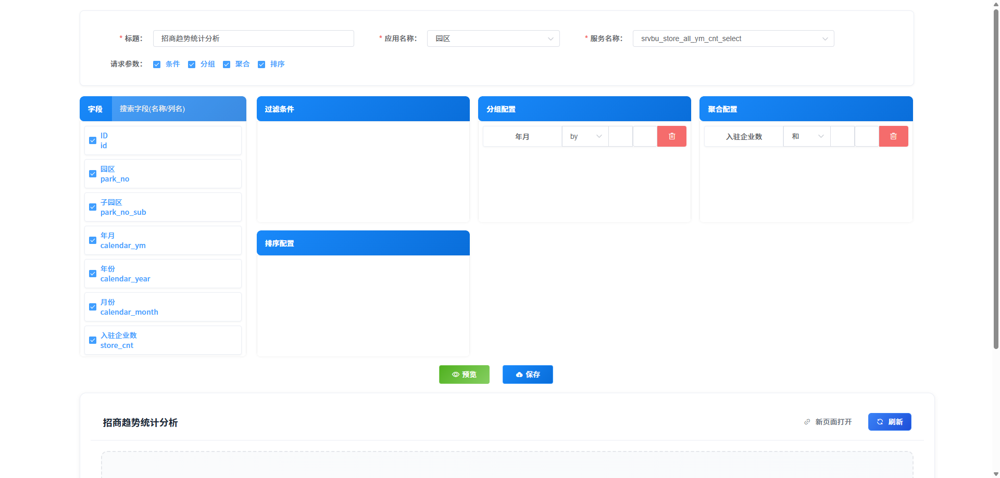
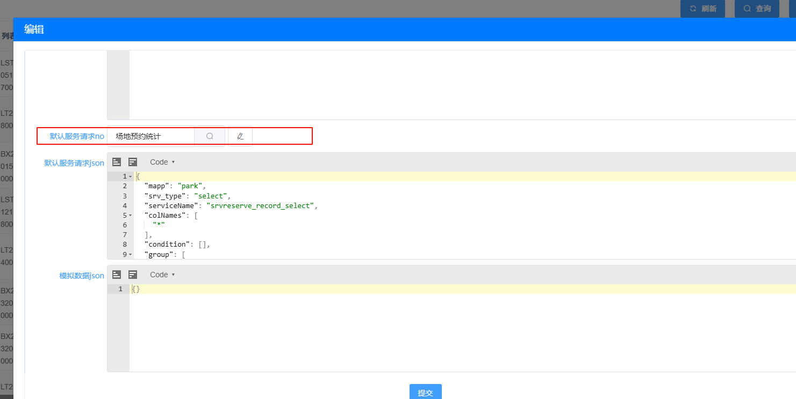
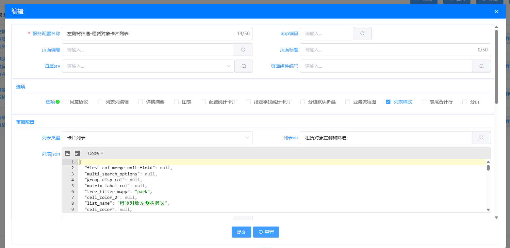
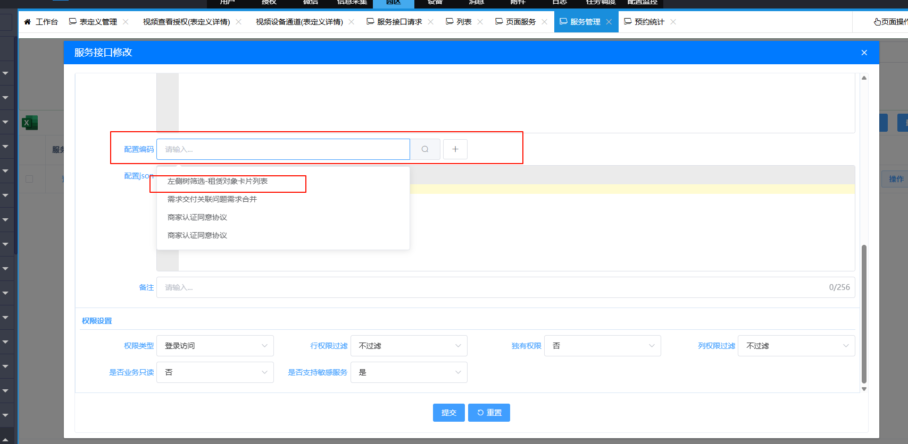
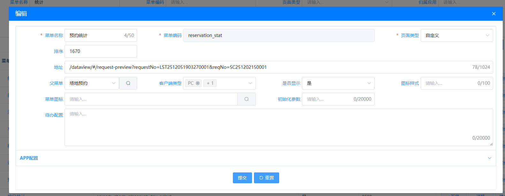

# 统计列表配置

## 概述

统计列表配置是用于创建和管理数据可视化统计列表的功能，通过该配置可以实现数据的分组统计、聚合展示，并以图表+表格的形式呈现给用户。本文档将详细介绍统计列表的完整配置流程。

## 配置步骤

### 1. 创建服务接口请求

**操作路径**：后台管理 → 配置监控 → DIY页面 → 接口请求 → 服务接口请求

**配置说明**：

- 添加一条新的服务接口请求
- 必须配置至少一条分组规则和一条聚合规则
- 分组字段将作为统计图表的X轴（名称）
- 聚合字段将作为统计图表的Y轴（数量）

  

### 2. 定义列表组件

**操作路径**：后台管理 → 配置监控 → DIY页面 → 组件定义 → 列表

**配置说明**：

- 添加一个新的列表组件
- 在接口请求选项中选择上一步创建的服务接口请求

  

### 3. 配置页面服务

**操作路径**：园区APP → 平台配置 → 页面配置 → 页面服务

**配置说明**：

- 添加一条新的页面服务数据
- 列表类型选择「卡片列表」
- 列表NO选择刚刚创建的列表组件

  

### 4. 关联服务配置

**操作路径**：园区APP  → 平台配置 → 服务管理 → 服务管理

**配置说明**：

- 找到列表组件对应的服务
- 在配置编码中选择上一步创建的页面服务配置

  

### 5. 添加访问菜单

**操作路径**：园区APP  → 平台配置 → 菜单管理

**配置说明**：

- 添加一条新的菜单数据
- 页面类型选择「自定义」
- 地址配置为：`/dataview/#/request-preview?requestNo=XXX`（其中XXX为列表组件的组件编号）

  

## 注意事项

1. **数据要求**：确保服务接口请求配置了正确的分组和聚合规则，否则统计列表无法正常显示数据
2. **组件编号**：菜单配置中的 `requestNo`必须与列表组件的组件编号完全匹配
3. **权限控制**：确保相关角色拥有访问该菜单的权限
4. **数据更新**：配置完成后，统计列表的数据会根据服务接口请求的配置自动更新

## 常见问题

### Q: 统计列表没有显示数据怎么办？

A: 请检查服务接口请求是否配置了正确的分组和聚合规则，以及服务是否能正常返回数据

### Q: 菜单点击后无法访问怎么办？

A: 请检查菜单地址中的 `requestNo`是否与列表组件的组件编号匹配，以及相关服务是否已正确配置

## 效果预览

配置完成后，用户可以通过菜单访问统计列表，查看以卡片形式展示的数据统计结果。列表将根据配置的分组和聚合规则，动态展示最新的数据统计信息。
