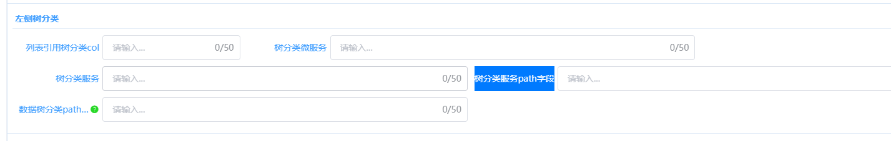

# 统计列表配置

## 配置步骤

1. **后台-配置监控-DIY页面-接口请求-服务接口请求**
   添加一条新的服务接口请求

2. **后台-配置监控-DIY页面-组件定义-列表**
   添加一个列表组件，列表选项选择树分类筛选，配置树分类col、微服务、树分类服务，两个path字段，下面接口请求选择上一步创建的接口请求

   

   

4. **园区-平台配置-页面配置-页面服务**
   添加一条数据，列表类型选择卡片列表，列表no选择刚刚创建的列表
   
   

5. **服务管理**
   找到列表对应的服务，配置编码选择上一步创建的配置
   
   

6. **添加菜单**
   菜单管理中配置对应菜单，页面类型选择自定义，地址配置/dataview/#/request-preview?requestNo=LST2512051903270001（列表组件的组件编号）
   